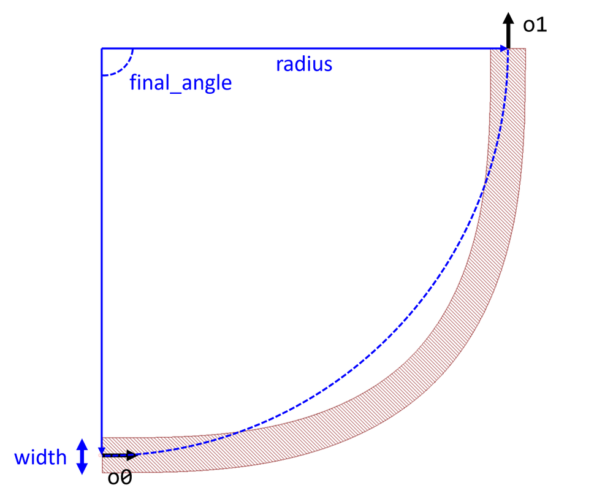

## Component Name : Bend
Author : Chung-Yu Hsu

- Bend with Euler curve (Adiabatic bend)
    

**og** : Local original point

**o0** : Optical port 0

**o1** : Optical port 1

**radius** : Effective bend radius

**width** : Width of waveguide