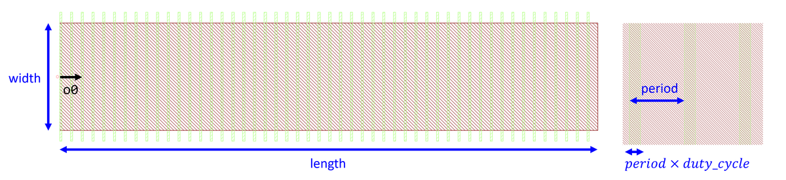

## Component Name : Emitter
Author : Chung-Yu Hsu

Shallow etched grating for light emitting.
    

**o0** : Optical port 0

**width** : The width of the slab waveguide.

**length** : The length of the slab waveguide.

**period** : The period of the etched grating.

**duty_cycle** : The duty cycle of the etched grating. `period × duty_cycle` is the length of the etched area.

**layer** : A list with two elements. `layer = [slab waveguide, etched grating]`