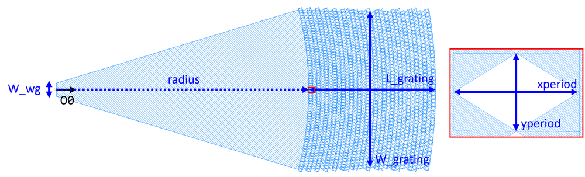

## Component Name : FGC
Author : Chung-Yu Hsu

- Fully etched broadband focusing grating coupler (FGC)
    

**og** : Local original point

**o0** : Optical port 0

**W_wg** : The width of the waveguide at the input

**radius** : The distance of the first period in r-direction

**xperiod** : The period of the first unit cell in x-direction

**yperiod** : The period of the first unit cell in y-direction

**L_grating** : The length of the grating structure

**W_grating** : The width of the device