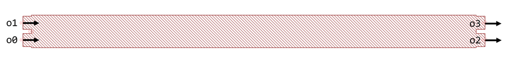

## Component Name : Mmi2x2
Author : Chung-Yu Hsu

- 50:50 2×2 MMI splitter
- Loss is ≤0.15±0.01 dB for 1530-1565 nm.
- Ref: https://doi.org/10.1109/JPHOT.2012.2230320

**og** : Local original point

**o0** : Optical port 0

**o1** : Optical port 1

**o2** : Optical port 2

**o3** : Optical port 3