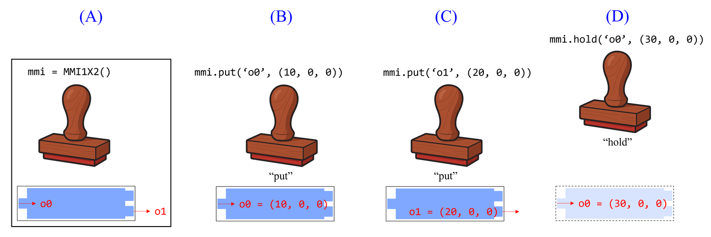
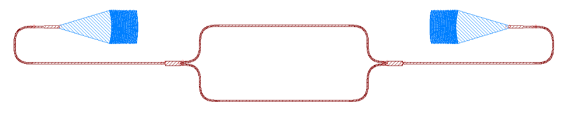

## Installation
❗This PDK has only been tested on Windows 11. If you're using a different operating system, such as macOS or Linux, you'll need to troubleshoot issues on your own.
1. Install Anaconda (https://www.anaconda.com).
2. Create a new environment.
3. Install all dependencies in the new environment.
4. Download this PDK from GitHub (https://github.com/chungyuhsu/pdk).
5. Decompress the ZIP file to any place you want.
6. Enjoy it!

### Dependencies
- **python 3.8.20**\
Newer version is not supported.
- **gdspy 1.6.12**\
Download and install it directly from GitHub (https://github.com/heitzmann/gdspy/releases/tag/v1.6.12).
- **numpy**

## Build Your Layout using Existing Components

### Basic Concept
Class likes a stamp factory which can manufacture customized stamps. For example, we use `mmi = MMI1X2()` to create a stamp. There is no parameter in `MMI1X2()`, but you can customized a stamp for the one who has parameters. The stamp can print many identical components on your layout. It has ports for the connecting with other components. After the stamp is created, you can use method `put(port, destination)` to print your component. `port` is the port of the component, and `destination` is where you want to print it. You can use another `put()` to print a identical component somewhere else. If you only want to generate a component instead of print it on your layout, you can use method `hold()`. Save `mmi.obj` before you use another `put()` or `hold()`, otherwise it will disappear.



### Build a Mach-Zehnder Interferometer (MZI) Step by Step

```python
# Import every components you need
import gdspy
from MMI1X2.MMI1X2 import MMI1X2
from Routing.Routing import Routing
from FGC.FGC import FGC
from Waveguide.Waveguide import Waveguide

# Draw an input GC.
gc = FGC()
gc.put('o0', (0, 0, 0))

# Draw a taper because of the waveguide width difference.
taper = Waveguide(2.1, 20, 1.2)
taper.put('o0', gc.port['o0'], flip_port=True)
# Sometimes, you need to connect two ports that have opposite directions.
# Enabling flip_port can make your life easier.

# Draw an U turn because the coupling angle of the GC is minus.
turn = Routing(path=['l', 'l', 100])
turn.put('o0', taper.port['o1'])

# Draw the first MMI.
mmi = MMI1X2()
mmi.put('o0', turn.port['o1'])

# Draw the lower arm of MZI.
wg1 = Routing(path=['r', 'l', 100, 'l', 'r'])
wg1.put('o0', mmi.port['o1'])

# Draw the upper arm of MZI.
wg2 = Routing(path=['l', 'r', 100, 'r', 'l'])
wg2.put('o0', mmi.port['o2'])

# Draw the second MMI.
# Because two MMIs are the same, we do not need to create another one.
mmi.put('o1', wg2.port['o1'], flip_port=True)

# Draw another U turn.
turn = Routing(path=[100, 'l', 'l'])
turn.put('o0', mmi.port['o0'], flip_port=True)

# Draw another taper.
taper = Waveguide(1.2, 20, 2.1)
taper.put('o0', turn.port['o1'])

# Draw an output GC.
gc.put('o0', taper.port['o1'])

# Generate the GDSII layout.
gdspy.write_gds('test.gds')
```


### Component List
| Name | Description |
|-|-|
| Component | Basic template for the other components|
| MMI1X2 | 1×2 MMI |
| MMI2X2 | 2×2 MMI |
| Waveguide | Waveguide |
| Bend ||
| FGC ||
| Routing ||
| Template ||

## Create a Customized Component
- For convenience, we only use one cell named 'cell'.
- Each component has its folder. Each folder is a package with a component inside.
- It is necessary to create documents for your component. So people can understand how to use it.
- All images must be saved as .png and <500 KB
- For each optical component, there is at least one optical port named 'o0'.

### Layer Information
- This is just for reference. You can define your own layer.
- Datatype must be zero for non-zero layer.

| Layer | Datatype | Description |
| - | - | - |
| 0 | 0 | Port labels |
| 0 | 1 | Chip |
| 0 | 2 | Fields |
| 10 | 0 | Fully etched layer: low dosage |
| 11 | 0 | Fully etched layer: medium dosage |
| 12 | 0 | Fully etched layer: high dosage |
| 13 | 0 | Fully etched layer: ultra dosage |
| 20 | 0 | Partially etched layer |
| 30 | 0 | Heater layer |
| 40 | 0 | Wiring layer |