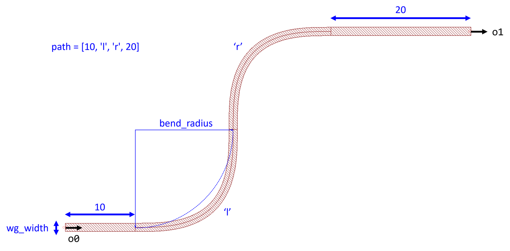

## Component Name : Routing
Author : Chung-Yu Hsu
    

**o0** : Optical port 0

**o1** : Optical port 1

**path** : Control the route. For example: path = [10, 'l', 'r', 20] means go straight for 10 μm, then turn left and turn right, then keep going for 20 μm.

**wg_width** : Width of the route

**bend_radius** : Bend radius used in the route