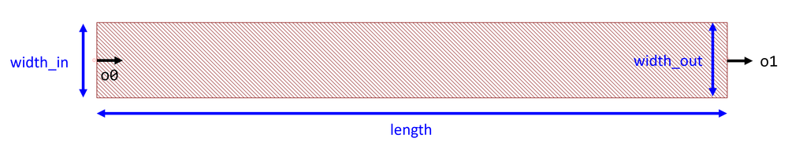

## Component Name : Waveguide
Author : Chung-Yu Hsu

- Loss: -1 dB/cm for width = 1.2 µm\n
    

**og** : Local original point

**o0** : Optical port 0

**o1** : Optical port 1

**width_in** : Initial waveguide width

**length** : Waveguide length

**width_out** : Final waveguide width

**layer** : Layer of waveguide