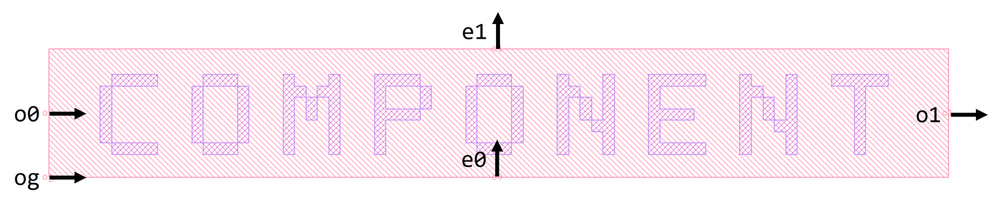

## Component Name : Component
Author : Chung-Yu Hsu

The basic template for the other components. The class has a put method which can put your component any place you want.

**og** : Local original point

**o0** : Optical port 0

**o1** : Optical port 1

**e0** : Electric port 0

**e1** : Electric port 1